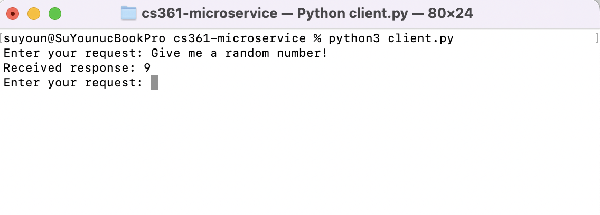
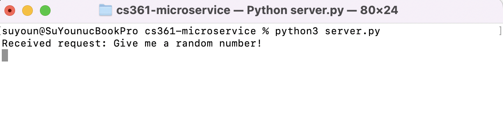
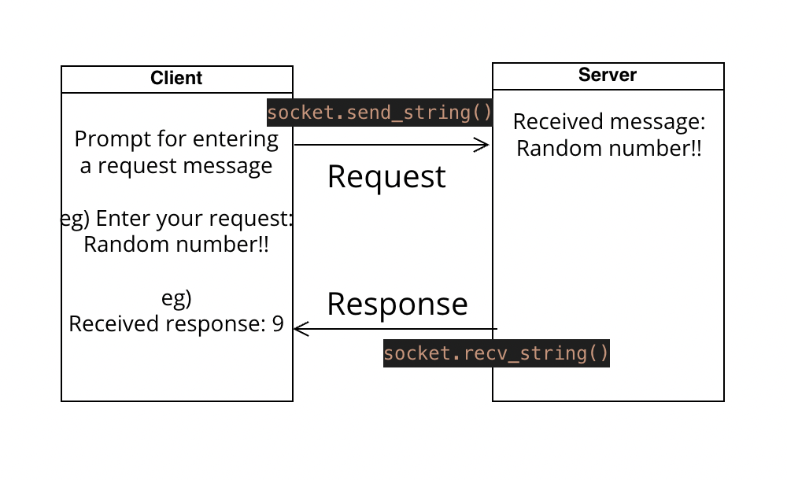

# cs361-microservice

This repository contains a simple example of a ZeroMQ server that generates random numbers in response to requests.

## Getting Started

### Prerequisites

- Python 3.x
- ZeroMQ library (`pyzmq`)

## Communication

### How to Request and Receive Data:

Run the server first by opening a terminal and running a command ```python server.py``` or `python3 server.py`

The server will bind to `tcp://127.0.0.1:5555`.

Open another terminal and run the command `python client.py` or `python3 client.py`

The client will initiate a prompt for entering a request message. You can input any message, such as "Give me the random number!" and press Enter.

Following this, it will dispatch the request message to the server using `socket.send_string()`. Subsequently, it will wait for and collect the response from the server through `socket.recv_string()`. The received response, showcasing the generated random number, will be displayed on the client side. Additionally, the server.py terminal will reveal the received request message.

### Example Call
Below is an illustration of using client.py:

The client initiates a request by sending the message ("Give me a random number!") to the server. Subsequently, it receives the server's response (in this instance, the received random number is 9).

Below is an illustration of the server side.


### UML Diagram



